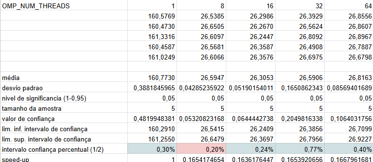
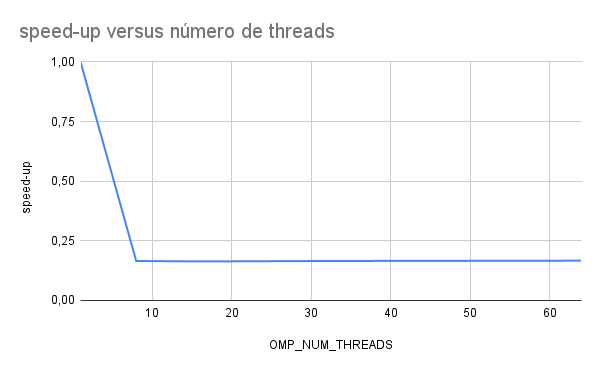

## Questão 2.

### Processo de desenvolvimento:

Buscamos um código do crivo de Eratóstenes online, e começamos a modificar ele. Verificamos que ele consiste em um loop principal, pela qual realizamos a paralelização:


```c++
#pragma omp parallel for schedule(dynamic)
    for (int i = 2; i <= limite; i++) {
        if (primos[i]) {
            #pragma omp parallel for schedule(dynamic)
            for (int j = i * i; j <= N; j += i) {
                primos[j] = 0;
            }
        }
    }
```
Aqui, nós tiramos os valores de i com base nas threads que os iniciam, e vamos desmarcando seus múltiplos como primos até chegarmos a N. Verifique que só vamos ter valores de i até um limite, que é definido como a raiz de N.


### Medição de desempenho





É possível notar que há o speed-up até o uso de 8 threads. Depois, a performance estabiliza. Isso provavelmente acontece pela separação de valores dado o número de threads, que é sempre múltiplo de 8. 