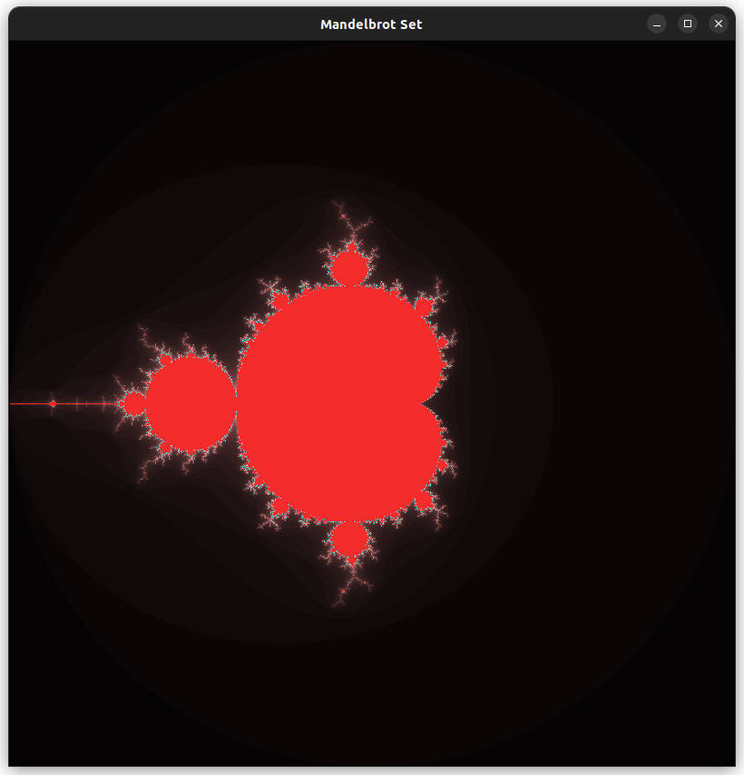

## Questão 2.

### Processo de desenvolvimento:

A compilação do arquivo sequencial disponibilizado no AVA ocorreu sem intercorrências. O primeiro problema que o grupo encontrou foi na hora de executar o programa: a imagem gerada e apresentada na janela criada no X11 tinha a sua parte de cima invisível. Foi postulado que isso ocorria por conta do tempo que a janela demorava pra abrir (nesse intervalo, o loop já estaria rodando), então o programa tentava desenhar a metade de cima da imagem ainda antes de ter uma janela aberta disponível.

Para corrigir, foi simplesmente incluído um sleep de 1 segundo entre o pedido de abertura da janela para o server X11 e o início do loop principal, tempo mais que suficiente para a janela abrir.

O mandelbrot colorido foi relativamente fácil de implementar: por meio da função `XSetForeground`, definimos a cor do pixel a ser desenhado, que é calculada com base em k. A escolha de k em particular é por efeitos visuais: se o número diverge rapidamente, ele tende a ficar mais escuro, além de podermos escolher o tom exato que queremos para o conjunto em si definindo k = 100.



A paralelização do código foi feita por meio de duas diretivas do OpenMP. A primeira diz respeito ao loop principal:

```c++
#pragma omp parallel for shared(display, win, gc) private(j, z, c, k, lengthsq, temp) schedule(static)
```

Foram declaradas explicitamente as variáveis que deveriam ser privadas, sendo elas as que envolviam operações de atribuição, e as variáveis compartilhadas, sendo elas as que envolviam apenas leitura.

O tipo de escalonamento foi estático, cada thread responsável por desenhar um determinado bloco de linhas da imagem final (o loop externo foi o paralelizado).

A segunda diretiva dizia respeito às operações de IO envolvendo o desenho de fato dos pixels na janela do X11:

```c++
#pragma omp critical
{
    XSetForeground(display, gc, color);
    XDrawPoint(display, win, gc, j, i);
}
```

Ela apenas garante que essas operações sejam feitas uma thread por vez, para evitar problemas de concorrência.

Antes de começar os testes, uma última mudança foi feita: o número de threads é recebido pela entrada padrão para evitar a necessidade de recompilar o programa para cada teste. A compilação foi feita com o comando `gcc -fopenmp -o mandelbrot mandelbrot.c -lX11 -lm`.

### Medição de desempenho