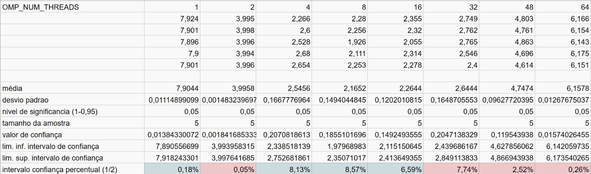
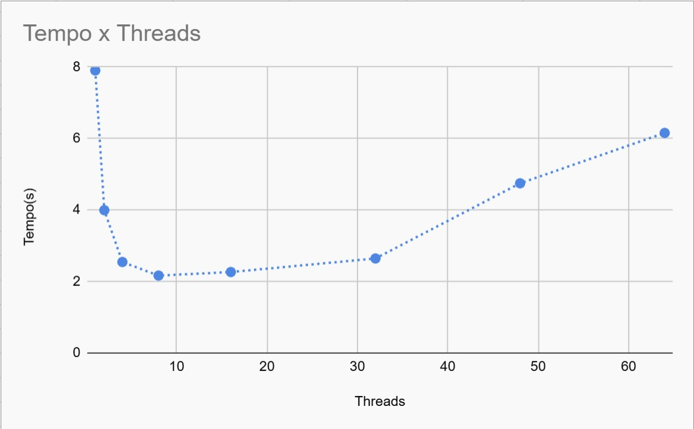
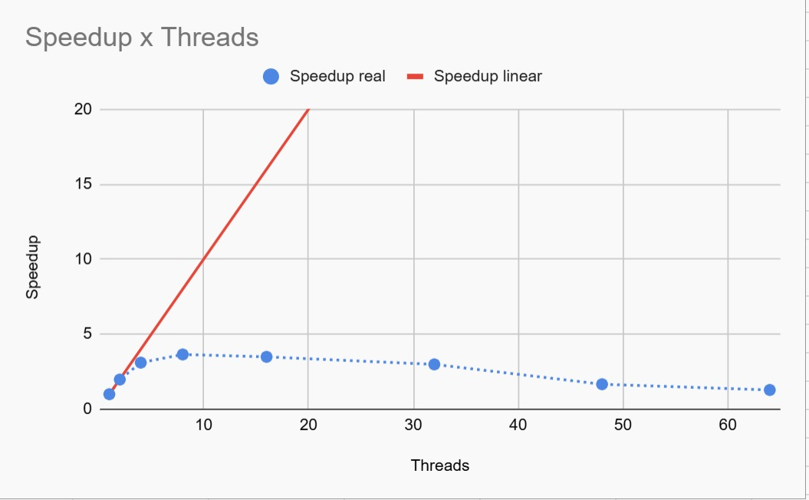
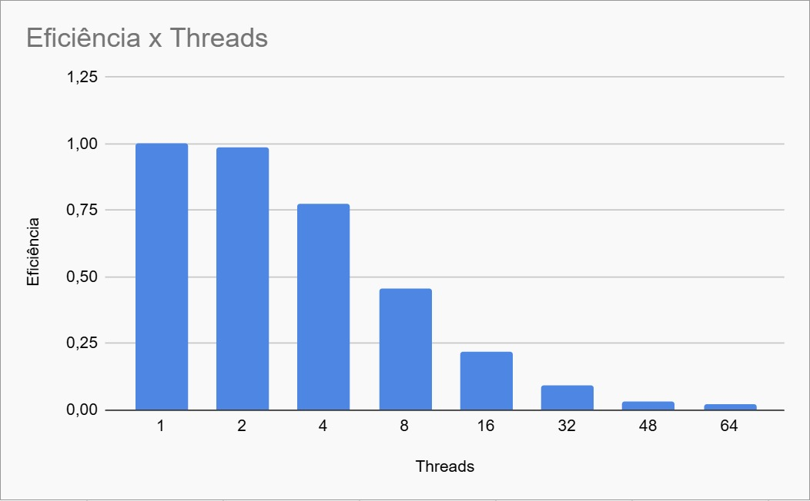
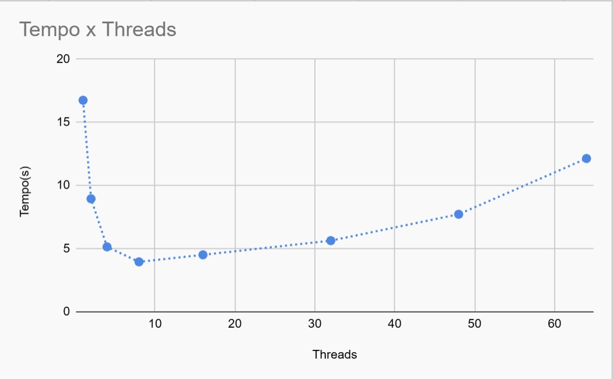
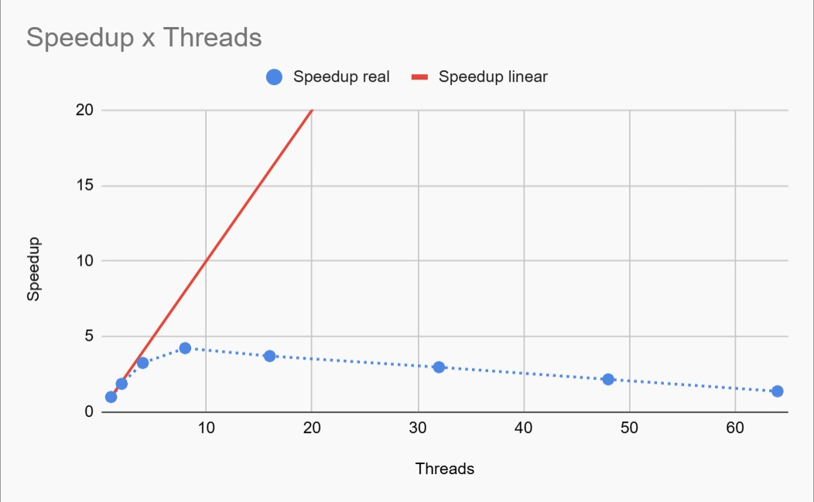
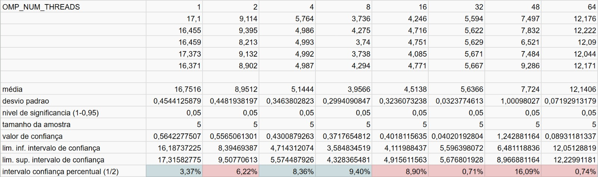
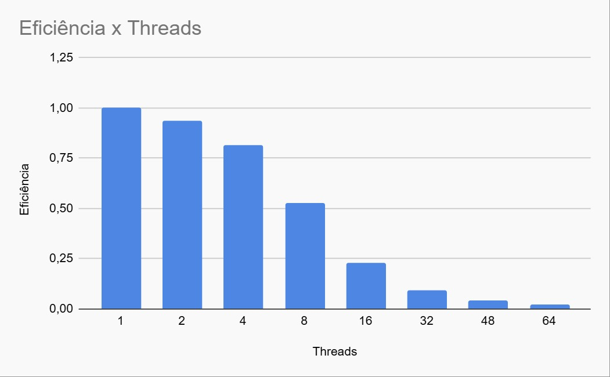

## Questão 1

### Algoritmo de sort escolhido

O algoritmo de sort escolhido foi a implementação da biblioteca nativa do C, `qsort`, que implementa o algoritmo de quick sort.
A escolha foi feita não só por praticidade, mas também por estar entre os algoritmos mais rápidos conhecidos de ordenação, com
uma complexidade, no melhor caso, de $O(n \log n)$.

### Paralelização

A paralelização é simples: dividimos o vetor que desejamos ordenar em pedaços de tamanho igual, e damos cada pedaço para uma thread
utilizando:

```c 
MPI_Scatter(data, chunk_size, MPI_INT, local_data, chunk_size, MPI_INT, 0, MPI_COMM_WORLD);
```

Cada thread ordena seu pedaço via qsort, e depois reunimos todos os pedaços novamente utilizando:

```c
MPI_Gather(local_data, chunk_size, MPI_INT, data, chunk_size, MPI_INT, 0, MPI_COMM_WORLD);
```

E agora, temos um vetor com n pedaços, cada um deles já ordenado.

### "Calcanhar de aquiles" sequencial

Agora, para chegar ao vetor final ordenado, precisamos passar por cada um desses pedaços e colocar seus membros em ordem crescente
no vetor final. Podemos fazer isso por meio da seguinte função:

```c
int* merge_sorted_arrays(int *data, int chunk_size, int num_chunks) {
    int *output = malloc(chunk_size * num_chunks * sizeof(int));
    int *indices = calloc(num_chunks, sizeof(int));
    for (int i = 0; i < chunk_size * num_chunks; ++i) {
        int min_val = __INT_MAX__;
        int min_idx = -1;
        for (int j = 0; j < num_chunks; ++j) {
            if (indices[j] < chunk_size) {
                int val = data[j * chunk_size + indices[j]];
                if (val < min_val) {
                    min_val = val;
                    min_idx = j;
                }
            }
        }
        output[i] = min_val;
        indices[min_idx]++;
    }
    free(indices);
    return output;
}
```

Que pega o elemento mínimo atual entre os pedaços e coloca-o na lista final. A complexidade desse algoritmo, no entanto, é $O(n*k)$
com *k* sendo o número de pedaços - ou seja, de threads - que criamos. Isso pode se tornar uma fraqueza do programa, pois é uma parte
sequencial que cresce conforme o número de threads cresce.

### Resultados

#### N=10.000.000

- Valores:



- Tempo:



- Speedup:



- Eficiência:



#### N=20.000.000

- Valores:


- Tempo:



- Speedup:



- Eficiência:


#### N=40.000.000

- Valores:



- Tempo:


- Speedup:


- Eficiência:



### Análise dos resultados

É possível notar uma queda brusca na eficiência acima de 8 threads. Postulamos que esse fenômeno tem relação com ser aproximadamente nesse número de threads que
k se torna maior do que log(n), ou seja, a complexidade $O(n \log n)$ do quick sort padrão feito sequencialmente no vetor inteiro passa a "ganhar" do desempenho
de um quick sort $O(n \log n)$ paralelizado seguido de um algoritmo $O(nk)$. Apesar de não termos conseguido chegar a uma prova rigorosa desta ideia, faz bastante
sentido intuitivo.

