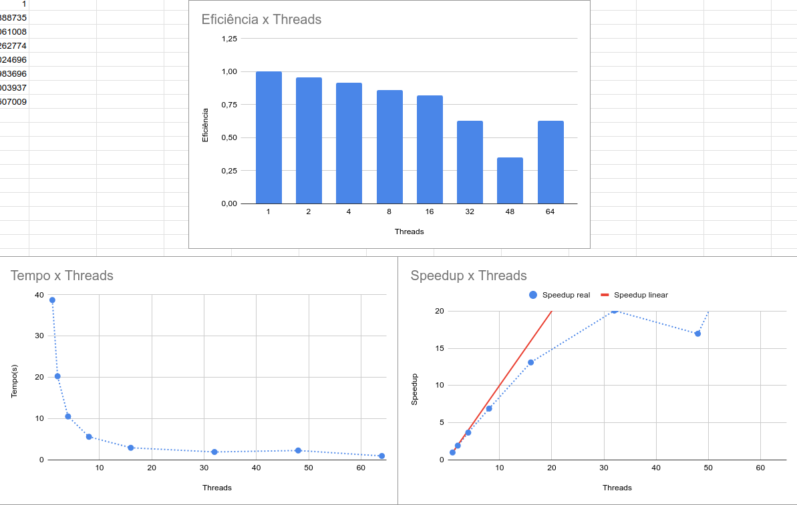
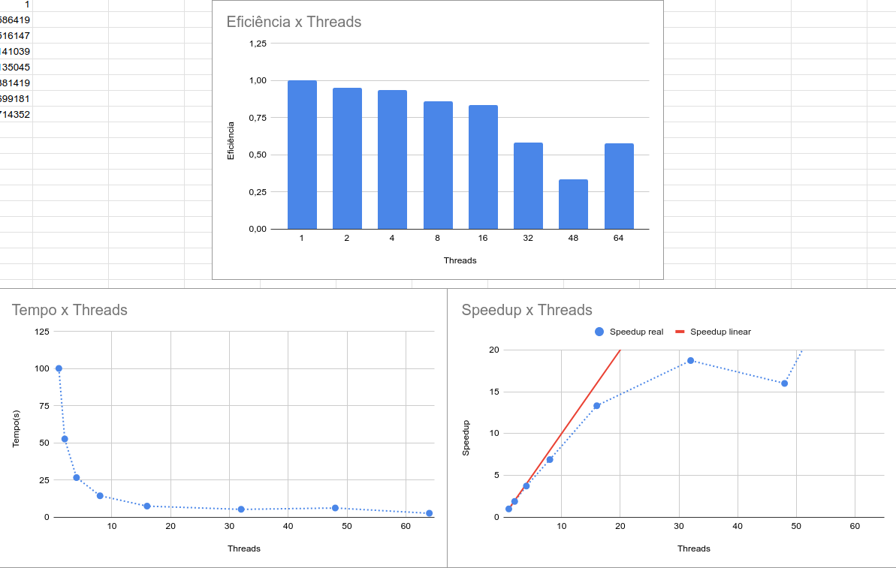
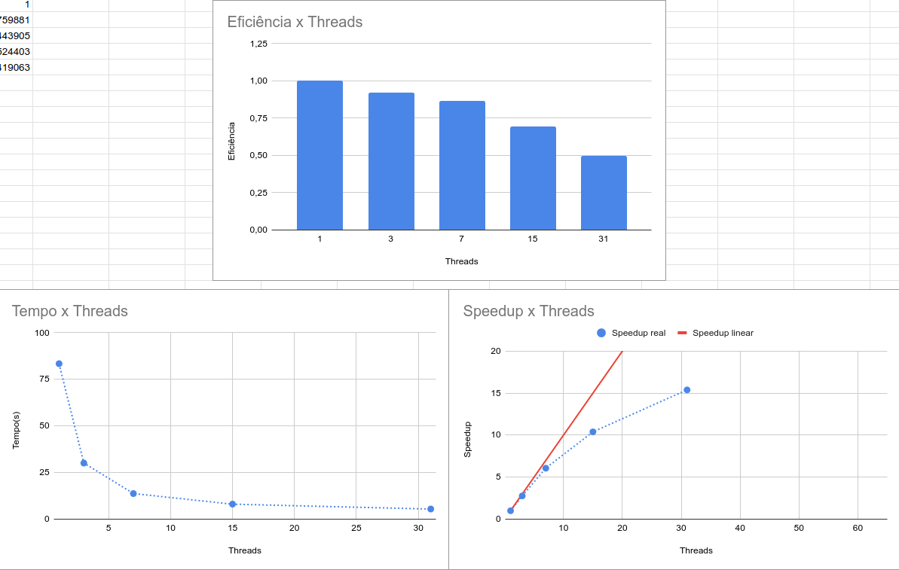

## Questão 3

### Considerações

Os valores propostos no enunciado estavam resultando em tempos muito longos, então foram reduzidos para
$10^8$ e $2*10^8$.

### Resultados

#### mpi_primos.c

- $n=10^8$

- $n=2 * 10^8$

#### mpi_primosbag.c

*Obs.*: Pelo fato de esse programa não poder ser rodado com apenas um processo, e também pelo fato de o processo
mestre não realizar cálculos de primo nesse caso, os cálculos foram todos feitos com base no número de processos
slaves.

- $n=10^8$

- $n=2 * 10^8$

### Análise dos resultados

Os resultados para o `mpi_primos.c` foram como esperados, com exceção da execução com 48 threads, que apresentou
um speedup inesperadamente baixo. Não ficou claro para o grupo o porquê desse fenômeno, mesmo porque ele aconteceu
com ambos os tamanhos de N testados. Uma das teorias é que o MPI_Reduce (e possivelmente outras rotinas MPI) 
toma mais tempo pelo fato de o número de threads não ser uma potência de 2.

Os resultados para o `mpi_primosbag.c` foram um pouco mais estranhos. Mesmo levando em conta o fato de a thread
mestre não participar da computação do laço principal do programa, é extremamente estranho que, para $N = 10^8$,
o programa se tornou extremamente lento (a ponto de não conseguirmos medir) de 32 threads pra cima, enquanto para
$N = 2 * 10^8$, o programa apresentou o mesmo comportamento de 48 threads pra cima. Uma teoria é que algum bug tenha
causado um laço while infinito dentro do processo mestre para determinados valores, mas não foi possível verificá-la.
Como resultado, só foram colocados no gráfico os valores que conseguimos medir, que seguiram um padrão esperado.

### Lei de Gustafson

- Rodando com 4 processos, foi verificada uma fração de tempo de código sequencial de aproximadamente 40%.
- Essa fração foi adquirida medindo o tempo apenas do loop e vendo qual fração do código acontece fora desse loop.
- O valor de n escolhido foi de 100.000.000, e o programa foi rodado na máquina pessoal de um integrante do grupo.
- Pela lei de Gustafson:
        $$S = N + (1 - N) * 0.4$$
        $$S = N + 0.4 - 0.4N = 0.6N + 0.4$$

